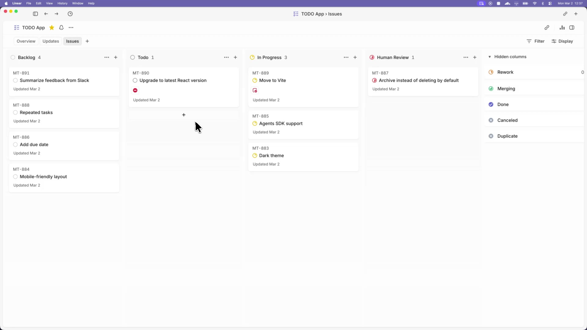

# Symphony Lark

Symphony Lark is a Lark Tasks fork of [OpenAI Symphony](https://github.com/openai/symphony). The fork stays structurally close to upstream so upstream changes stay easier to merge, but every agent-visible surface in this repo is Lark-only.

## What Changed

- Lark Tasks replaces Linear as the only supported tracker.
- The default workflow file is [`elixir/WORKFLOW.lark.md`](elixir/WORKFLOW.lark.md).
- The repo-local install entrypoint is `install-symphony-lark`.
- Repo-local Linear skills, prompts, and workflow examples are removed so Codex does not spend runtime context on unused tracker logic.

## Fastest Setup

Use the repo-local install skill:

> Use `install-symphony-lark` to clone this repo into `/path/to/symphony-lark`, verify the toolchain, guide the Lark setup, and start Symphony with `elixir/WORKFLOW.lark.md`.

The skill requires an explicit clone path. All `git` commands should run only inside that checkout.

## Install The Skill Globally

If you want to reuse the install skill from other repos, use Codex's built-in `skill-installer`:

> Install the skill from `yuleisheng/symphony-lark` at path `.codex/skills/install-symphony-lark`

Then restart Codex and invoke it with:

> Use `install-symphony-lark` to set up Symphony Lark on this machine.

## Manual Setup

The full manual path lives in [`elixir/README.md`](elixir/README.md). It covers:

- required env vars
- how to create the Lark app and grant Task permissions
- how to create the shared tasklist and `Status` field
- how to obtain `tasklist_guid`
- how to run Symphony with `WORKFLOW.lark.md`

## Upstream Sync

This fork is intentionally Lark-only at the product surface, but the internal layout stays close to upstream Symphony. Keep upstream syncs small and regular, and keep Lark-specific changes grouped in:

- `elixir/lib/symphony_elixir/lark`
- `elixir/lib/symphony_elixir/codex/dynamic_tool.ex`
- `elixir/WORKFLOW.lark.md`
- `.codex/skills/install-symphony-lark`
- `.codex/skills/lark-task`

## License

This project is licensed under the [Apache License 2.0](LICENSE).
